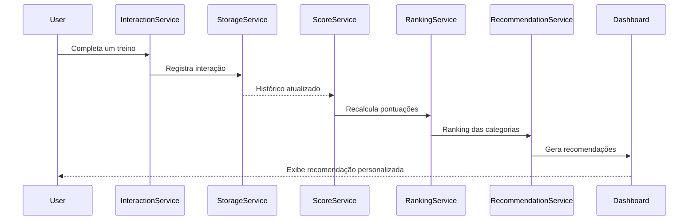

# Recommendation Engine

> _"The Recommendation Engine is the heart of ROOT."_

---

# Visão Geral

O Recommendation Engine é o núcleo inteligente do ROOT e o principal diferencial da plataforma.

Enquanto aplicativos tradicionais de fitness apenas registram atividades, o ROOT observa continuamente o comportamento do usuário para oferecer recomendações personalizadas, relevantes e transparentes.

O mecanismo foi projetado para ser desacoplado da interface, permitindo sua evolução ao longo do tempo sem impactar a experiência do usuário.

Desde a primeira versão, sua arquitetura será preparada para suportar estratégias mais sofisticadas, incluindo Machine Learning e Inteligência Artificial.

---

# Objetivos

O Recommendation Engine deve ser capaz de:

- Aprender continuamente com o comportamento do usuário.
- Incentivar hábitos saudáveis de forma equilibrada.
- Recomendar atividades relevantes para cada momento.
- Explicar todas as recomendações geradas.
- Evoluir sem alterar a interface da aplicação.
- Ser facilmente testável.
- Ser independente da tecnologia de persistência.

---

# Como o mecanismo funciona

Sempre que o usuário interage com a aplicação, um novo evento é registrado.

Esses eventos alimentam o histórico do usuário.

A partir desse histórico, o sistema calcula pontuações, gera rankings e produz recomendações personalizadas.

Fluxo simplificado:

```text
Usuário

↓

Interação

↓

Interaction Tracker

↓

Interaction History

↓

Score Calculator

↓

Ranking Engine

↓

Recommendation Engine

↓

Dashboard
```

---

# Arquitetura Geral

```text
                     Dashboard
                         │
                         ▼
              RecommendationService
                         │
        ┌────────────────┼────────────────┐
        ▼                ▼                ▼
InteractionService   ScoreService   RankingService
        │                │                │
        └────────────────┼────────────────┘
                         ▼
                  StorageService
                         │
                         ▼
                    LocalStorage
```

Cada serviço possui apenas uma responsabilidade.

---

# Componentes

## RecommendationService

Responsável por orquestrar todo o mecanismo de recomendação.

Responsabilidades:

- Solicitar histórico do usuário.
- Consultar o ScoreService.
- Consultar o RankingService.
- Gerar a lista final de recomendações.
- Adicionar justificativas para cada recomendação.

Não possui responsabilidade de persistência nem cálculo.

---

## InteractionService

Responsável por registrar todas as interações do usuário.

Exemplos:

- Workout Started
- Workout Completed
- Workout Abandoned
- Habit Completed
- Recommendation Clicked
- Recommendation Ignored
- Screen Viewed

Toda interação gera um evento.

---

## ScoreService

Responsável por calcular a pontuação das categorias.

Exemplo:

```text
Strength

Clicks: 18

Completed: 15

Ignored: 1

Score: 87
```

O algoritmo poderá evoluir sem alterar os demais serviços.

---

## RankingService

Recebe todas as pontuações e gera um ranking ordenado.

Exemplo:

```text
Strength

87

Cardio

40

Recovery

12

Mobility

5
```

Esse ranking será utilizado pelo RecommendationService.

---

## StorageService

Abstrai completamente a persistência.

Na MVP:

LocalStorage.

Futuras evoluções:

- REST API
- Firebase
- Supabase
- PostgreSQL

Nenhum outro serviço conhece a implementação da persistência.

---

# Eventos

Toda interação gera um evento.

## Eventos previstos

| Evento                   | Descrição                        |
| ------------------------ | -------------------------------- |
| workout_started          | Usuário iniciou um treino        |
| workout_completed        | Usuário concluiu um treino       |
| workout_abandoned        | Usuário abandonou um treino      |
| recommendation_clicked   | Usuário abriu uma recomendação   |
| recommendation_dismissed | Usuário ignorou uma recomendação |
| habit_completed          | Usuário registrou um hábito      |
| page_view                | Usuário acessou uma tela         |
| goal_updated             | Usuário alterou um objetivo      |

---

# Histórico de Interações

Todos os eventos ficam armazenados para formar o histórico do usuário.

Exemplo:

```json
[
  {
    "type": "workout_completed",
    "category": "strength",
    "createdAt": "2026-07-10T18:00:00"
  },
  {
    "type": "habit_completed",
    "category": "hydration",
    "createdAt": "2026-07-10T19:15:00"
  }
]
```

Esse histórico é a principal fonte de dados do Recommendation Engine.

---

# Categorias

O mecanismo trabalhará inicialmente com as seguintes categorias:

- Strength
- Cardio
- Mobility
- Recovery
- Stretching
- Hydration
- Nutrition
- Sleep

Novas categorias poderão ser adicionadas futuramente sem alterar a arquitetura.

---

# Estratégia V1

Primeira versão do algoritmo.

Critério:

Frequência.

Exemplo:

| Categoria | Interações |
| --------- | ---------: |
| Strength  |         18 |
| Cardio    |          8 |
| Hydration |          5 |
| Mobility  |          1 |
| Recovery  |          0 |

Quanto menor a frequência, maior será a prioridade da recomendação.

Objetivo:

Estimular hábitos negligenciados.

---

# Estratégia V2

Adicionar Recência.

Além da frequência, considerar:

- Quantos dias fazem desde a última interação.

Exemplo:

```text
Score Final

↓

Frequência

+

Dias sem acessar
```

---

# Estratégia V3

Adicionar objetivos do usuário.

Exemplo:

Objetivo:

Hipertrofia.

As categorias passam a possuir pesos.

```text
Strength

Peso 1.0

Recovery

Peso 0.8

Cardio

Peso 0.5

Mobility

Peso 0.9
```

---

# Estratégia V4

Adicionar regras configuráveis.

Exemplo:

```text
IF

Strength > 5

AND

Mobility = 0

THEN

Recommend Mobility
```

As regras poderão ser configuradas sem alterar o código do RecommendationService.

---

# Estratégia V5

Preparação para Machine Learning.

A arquitetura permitirá substituir o RankingService por um modelo treinado.

Exemplo:

```text
Histórico

↓

Modelo ML

↓

Recomendação
```

Sem alterar a interface da aplicação.

---

# Explicabilidade

Nenhuma recomendação será apresentada sem contexto.

Exemplo:

> Você realizou treinos de força durante cinco dias consecutivos e ainda não registrou nenhuma sessão de mobilidade nesta semana.

Outro exemplo:

> Faz sete dias desde seu último treino de cardio.

Esse princípio está alinhado ao documento **Product Principles**, garantindo transparência para o usuário.

---

# Benefícios da Arquitetura

- Alta coesão
- Baixo acoplamento
- Fácil manutenção
- Fácil criação de testes
- Independente da interface
- Independente da persistência
- Escalável
- Preparada para IA
- Preparada para APIs
- Evolução incremental

---

# Evolução

```text
V1

↓

Frequência

↓

V2

↓

Recência

↓

V3

↓

Objetivos

↓

V4

↓

Regras Configuráveis

↓

V5

↓

Machine Learning

↓

V6

↓

Inteligência Artificial
```

---

# Fluxo de Sequência



---

# Roadmap

## V1

- Frequência
- LocalStorage
- Recomendações por categoria

## V2

- Recência
- Ranking inteligente
- Melhorias no cálculo de score

## V3

- Objetivos do usuário
- Pesos por categoria
- Recomendações mais personalizadas

## V4

- Estratégias configuráveis
- Regras dinâmicas
- Administração de recomendações

## V5

- Machine Learning
- API de recomendação
- Personalização avançada

## V6

- Inteligência Artificial
- Recomendações preditivas
- Adaptação automática do algoritmo

---

# Considerações Finais

O Recommendation Engine é o principal diferencial do ROOT.

Sua arquitetura foi concebida para evoluir de um mecanismo simples baseado em frequência para um sistema inteligente capaz de compreender padrões de comportamento e adaptar continuamente a experiência do usuário.

Todo o design da solução prioriza desacoplamento, escalabilidade, transparência e facilidade de evolução, garantindo que novas estratégias possam ser incorporadas sem impactar a interface da aplicação ou a experiência do usuário.
